# Katsuragi

[日本語版 README](./README.ja.md)

[](https://www.npmjs.com/package/katsuragi)
[](LICENSE)

## Half the tokens. Twice the clarity.

Turn UI ideas into wireframes with a text format AI actually understands.

### Who is this for?

- Developers discussing UI with non-technical stakeholders
- Engineers using AI coding assistants (Claude Code, Cursor, Aider)
- Teams who want git-diffable UI specs

### Why .kui?

```mermaid
---
config:
  themeVariables:
    xyChart:
      plotColorPalette: "#9CA3AF, #3B82F6, #F87171"
---
xychart-beta
    title "Tokens per wireframe (login example)"
    x-axis ["Natural Lang", "ASCII", ".kui", "HTML"]
    y-axis "Tokens" 0 --> 400
    bar [102, 84, 0, 0]
    bar [0, 0, 120, 0]
    bar [0, 0, 0, 330]
```



.kui hits the sweet spot between efficiency and reliability:

| Format | Tokens | Precise | Editable |
|--------|--------|---------|----------|
| Natural Language | 102 | ❌ | ❌ |
| ASCII Art | 84 | ⚠️ | ❌ |
| **.kui** | **120** | **✓** | **✓** |
| HTML | 330 | ✓ | ✓ |

**50% fewer tokens than HTML**, with the same precision.

[→ Full comparison with 3 patterns](./docs/analysis/README.md)

### How it works

Write a `.kui` file:

```kui
ratio: 16:9
grid: 2x2
A1: { type: txt, value: "Login", align: center }
A2..B2: { type: btn, value: "Submit" }
```

Run one command:

```bash
npx ktr login.kui -o login.png
```

Get this:


---

If this tool saves you time:

[](https://buymeacoffee.com/enlinks)

[Star this repo](https://github.com/enlinks-llc/katsuragi) to help others find it!

---

## Quick Start

### Install

```bash
# One-time use (no install)
npx ktr input.kui -o output.png

# Global install
npm install -g katsuragi
```

> **Tip:** `ktr` is a shorter alias for `katsuragi` - use whichever you prefer.

### Try It

```bash
# Create a sample file
cat > hello.kui << 'EOF'
ratio: 16:9
grid: 2x2
A1: { type: txt, value: "Hello Katsuragi!", align: center }
A2..B2: { type: btn, value: "Get Started" }
EOF

# Generate image
katsuragi hello.kui -o hello.png
```

### Usage

```bash
# Output SVG to stdout
ktr input.kui

# Save to file (format auto-detected from extension)
ktr input.kui -o output.svg
ktr input.kui -o output.png

# Explicit format
ktr input.kui -f png -o output.png

# Batch conversion
ktr *.kui -d ./output -f png

# Read from stdin
cat input.kui | ktr -o output.png
```

**CLI Options:**

| Option | Description |
|--------|-------------|
| `-o, --output <file>` | Output file (default: stdout for SVG) |
| `-d, --output-dir <dir>` | Output directory for batch conversion |
| `-f, --format <format>` | Output format: `svg` or `png` (default: `svg`) |
| `-V, --version` | Show version number |
| `-h, --help` | Show help |

## Why Text-Based?

Katsuragi uses a text format because **AI can read and write it**.

| Traditional Tools | Katsuragi |
|-------------------|-----------|
| Design in Figma, export, share screenshot | Describe in text, generate image |
| AI can't edit your design file | AI can write and modify .kui files |
| "Make the button bigger" requires manual work | AI understands and updates the code |

### Why Plain Text Works with AI

- **Easy to copy/paste** - No binary format, no special tools needed
- **Fits in context windows** - .kui files are small, AI can hold entire layouts in memory
- **Diff-friendly** - Changes are trackable in git, easy to review
- **No vendor lock-in** - Works with any LLM (ChatGPT, Claude, Gemini, local models)

### Workflow with AI

1. **Add .kui spec to your project** (in `AGENTS.md`, system prompt, or project docs)
2. Ask AI: "Create a login wireframe in .kui format"
3. AI generates the .kui file
4. Run `ktr login.kui -o login.png`
5. Share the image, discuss, iterate
6. AI updates the .kui based on feedback

### Works with LLM-powered CLI Tools

- **Claude Code** - Add spec to CLAUDE.md
- **Cursor** - Add to project rules
- **Aider** - Include in context
- **Any LLM CLI** - Paste spec in system prompt or AGENTS.md

### Example Prompt

```
Here's the .kui format specification:
[paste the syntax section below]

Create a mobile app wireframe for a task management app.
Use 2x5 grid (ratio 9:16).
Include: header with title, task list area, and floating action button.
```

Once the AI knows the format, it can generate and modify .kui code reliably.

## .kui File Format

```kui
ratio: 16:9
grid: 4x3
colors: { primary: "#3B82F6" }

// Header
A1..D1: { type: txt, value: "Login", align: center }

// Form
A2..D2: { type: input, label: "Email" }
A3..C3: { type: input, label: "Password" }
D3: { type: btn, value: "Submit", bg: $primary }
```

### Grid System

- `ratio` - Aspect ratio of the canvas (e.g., `16:9`, `4:3`, `1:1`, `9:16`)
- `grid` - Grid divisions as `columns x rows` (e.g., `4x3` creates columns A-D and rows 1-3)
- Cell references use Excel-style notation: `A1`, `B2`, `C3`
- Range notation: `A1..B3` (top-left to bottom-right)

### Gap & Padding

```kui
ratio: 16:9
grid: 3x2
gap: 8
padding: 24

A1: { type: box }
B1: { type: box }
C1: { type: box }
A2..C2: { type: txt, value: "Content area", padding: 16 }
```

- `gap` - Spacing between cells (in pixels, default: `0`)
- `padding` - Canvas margin (in pixels, default: `0`)
- Per-cell `padding` - Override content padding for individual cells

### Comments

Use `//` for comments:

```kui
// This is a comment
A1: { type: txt, value: "Hello" }  // End-of-line comment
```

### Components

| Type | Description | Properties | Defaults |
|------|-------------|------------|----------|
| `txt` | Text label | `value`, `align`, `bg`, `border`, `padding` | `align: left` |
| `box` | Empty box/container | `bg`, `border`, `padding` | `bg: #e0e0e0` |
| `btn` | Button | `value`, `bg`, `border`, `padding` | `bg: #e0e0e0` |
| `input` | Input field | `label`, `bg`, `border`, `padding` | `bg: white`, `border: black` |
| `img` | Image placeholder | `src`, `alt`, `bg`, `border`, `padding` | `bg: #f0f0f0`, `border: #ccc` |

### Colors

Define a color theme and use `$name` references:

```kui
colors: { primary: "#3B82F6", danger: "#EF4444", accent: "orange" }

A1: { type: btn, value: "Submit", bg: $primary }
A2: { type: btn, value: "Delete", bg: $danger, border: $accent }
B1: { type: box, bg: "#f0f0f0", border: "#ccc" }
B2: { type: box, bg: lightblue }
```

| Property | Description | Default |
|----------|-------------|---------|
| `bg` | Background color | Component-specific |
| `border` | Border color (2px width) | none |

Color formats:
- HEX: `#RGB` or `#RRGGBB` (e.g., `#f00`, `#3B82F6`)
- CSS color names: `red`, `blue`, `lightblue`, `orange`, etc.
- Theme reference: `$name` (requires `colors:` definition)

### Alignment

- `align`: `left` (default), `center`, `right`

### Multi-line Text

Use `\n` for line breaks:

```kui
A1: { type: txt, value: "Line 1\nLine 2\nLine 3" }
```

Or use backticks for multi-line strings:

```kui
A1: { type: txt, value: `
  Welcome to
  Katsuragi
` }
```

> **Note:** Automatic text wrapping is not supported. For long text, manually insert `\n` at desired break points.

### Output Size

The longest edge is fixed at 1280px. The shorter edge is calculated from the ratio:

- `16:9` → 1280 × 720
- `4:3` → 1280 × 960
- `1:1` → 1280 × 1280
- `9:16` → 720 × 1280 (mobile)

## More Examples


## Roadmap

- [x] Core components (txt, box, btn, input, img)
- [x] SVG/PNG export
- [ ] Markdown embedding (` ```kui ` code blocks)
- [ ] HTML export
- [ ] VS Code extension
- [ ] Web-based editor

## License

- **Open Source**: AGPL-3.0 (free if you open-source your code)
- **Commercial Products**: Free to use for building commercial products
- **Commercial License Required**: Only when embedding Katsuragi into SaaS platforms or distributing as closed-source

> **Example**: Using Katsuragi to create wireframes for your commercial app? Totally free. Integrating Katsuragi into your design tool SaaS? Commercial license required.

For commercial licensing, contact [En-Links LLC](https://github.com/enlinks-llc).

## Third-Party Licenses

This software uses the following open-source libraries:

| Library | License | Description |
|---------|---------|-------------|
| [sharp](https://sharp.pixelplumbing.com/) | Apache-2.0 | High-performance image processing |
| [libvips](https://github.com/libvips/libvips) | LGPL-3.0-or-later | Image processing library (sharp dependency) |
| [commander](https://github.com/tj/commander.js) | MIT | CLI argument parsing |

## Acknowledgments

Katsuragi is built on the shoulders of giants:

- **[libvips](https://github.com/libvips/libvips)** by John Googley-Fletcher and contributors - The fast image processing engine that powers our PNG generation
- **[sharp](https://github.com/lovell/sharp)** by Lovell Fuller - Making libvips accessible from Node.js with an elegant API
- **[commander.js](https://github.com/tj/commander.js)** by TJ Holowaychuk - The standard for building Node.js CLI tools

---

Copyright © 2025 [En-Links LLC](https://github.com/enlinks-llc)
