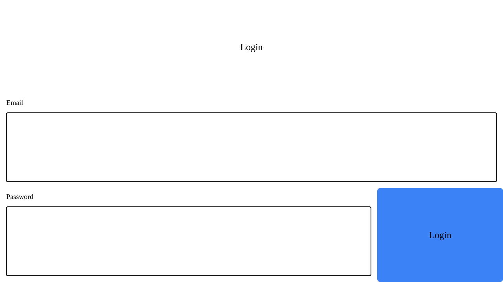
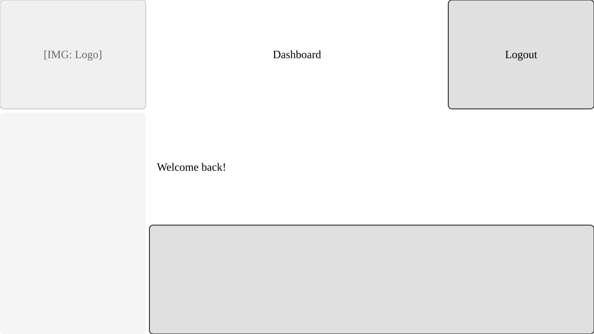
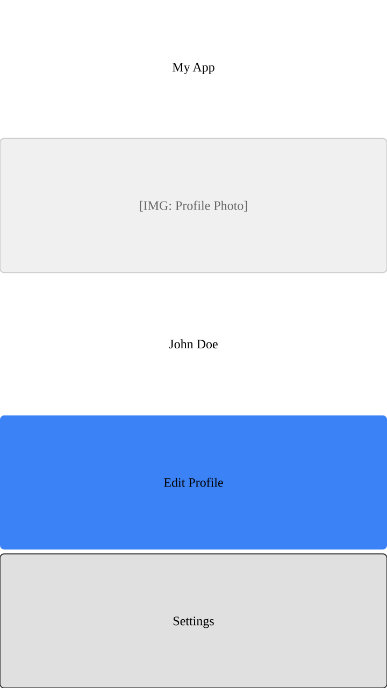

# Katsuragi

[日本語版 README](./README.ja.md)

[](https://www.npmjs.com/package/katsuragi)
[](LICENSE)

**Wireframes that AI can read and write.**

Describe your UI layout in a simple text format. Let ChatGPT, Claude, or any LLM generate, review, and iterate on wireframes with you.



## Why Text-Based?

Katsuragi uses a text format because **AI can read and write it**.

| Traditional Tools | Katsuragi |
|-------------------|-----------|
| Design in Figma, export, share screenshot | Describe in text, generate image |
| AI can't edit your design file | AI can write and modify .kui files |
| "Make the button bigger" requires manual work | AI understands and updates the code |

### Why Plain Text Works with AI

- **Easy to copy/paste** - No binary format, no special tools needed
- **Fits in context windows** - .kui files are small, AI can hold entire layouts in memory
- **Diff-friendly** - Changes are trackable in git, easy to review
- **No vendor lock-in** - Works with any LLM (ChatGPT, Claude, Gemini, local models)

### Workflow with AI

1. **Add .kui spec to your project** (in `AGENTS.md`, system prompt, or project docs)
2. Ask AI: "Create a login wireframe in .kui format"
3. AI generates the .kui file
4. Run `katsuragi login.kui -o login.png`
5. Share the image, discuss, iterate
6. AI updates the .kui based on feedback

### Works with LLM-powered CLI Tools

- **Claude Code** - Add spec to CLAUDE.md
- **Cursor** - Add to project rules
- **Aider** - Include in context
- **Any LLM CLI** - Paste spec in system prompt or AGENTS.md

### Example Prompt

```
Here's the .kui format specification:
[paste the syntax section below]

Create a mobile app wireframe for a task management app.
Use 2x5 grid (ratio 9:16).
Include: header with title, task list area, and floating action button.
```

Once the AI knows the format, it can generate and modify .kui code reliably.

## Quick Start

### Install

```bash
npm install -g katsuragi
```

### Try It

```bash
# Create a sample file
cat > hello.kui << 'EOF'
ratio: 16:9
grid: 2x2
A1: { type: txt, value: "Hello Katsuragi!", align: center }
A2..B2: { type: btn, value: "Get Started" }
EOF

# Generate image
katsuragi hello.kui -o hello.png
```

### Usage

```bash
# Generate SVG
katsuragi input.kui -o output.svg

# Generate PNG
katsuragi input.kui -o output.png
```

## .kui File Format

```kui
ratio: 16:9
grid: 4x3
colors: { primary: "#3B82F6" }

// Header
A1..D1: { type: txt, value: "Login", align: center }

// Form
A2..D2: { type: input, label: "Email" }
A3..C3: { type: input, label: "Password" }
D3: { type: btn, value: "Submit", bg: $primary }
```

### Grid System

- `ratio` - Aspect ratio of the canvas (e.g., `16:9`, `4:3`, `1:1`, `9:16`)
- `grid` - Grid divisions as `columns x rows` (e.g., `4x3` creates columns A-D and rows 1-3)
- Cell references use Excel-style notation: `A1`, `B2`, `C3`
- Range notation: `A1..B3` (top-left to bottom-right)

### Comments

Use `//` for comments:

```kui
// This is a comment
A1: { type: txt, value: "Hello" }  // End-of-line comment
```

### Components

| Type | Description | Properties | Defaults |
|------|-------------|------------|----------|
| `txt` | Text label | `value`, `align`, `bg`, `border` | `align: left` |
| `box` | Empty box/container | `bg`, `border` | `bg: #e0e0e0` |
| `btn` | Button | `value`, `bg`, `border` | `bg: #e0e0e0` |
| `input` | Input field | `label`, `bg`, `border` | `bg: white`, `border: black` |
| `img` | Image placeholder | `src`, `alt`, `bg`, `border` | `bg: #f0f0f0`, `border: #ccc` |

### Colors

Define a color theme and use `$name` references:

```kui
colors: { primary: "#3B82F6", danger: "#EF4444", accent: "orange" }

A1: { type: btn, value: "Submit", bg: $primary }
A2: { type: btn, value: "Delete", bg: $danger, border: $accent }
B1: { type: box, bg: "#f0f0f0", border: "#ccc" }
B2: { type: box, bg: lightblue }
```

| Property | Description | Default |
|----------|-------------|---------|
| `bg` | Background color | Component-specific |
| `border` | Border color (2px width) | none |

Color formats:
- HEX: `#RGB` or `#RRGGBB` (e.g., `#f00`, `#3B82F6`)
- CSS color names: `red`, `blue`, `lightblue`, `orange`, etc.
- Theme reference: `$name` (requires `colors:` definition)

### Alignment

- `align`: `left` (default), `center`, `right`

### Multi-line Text

Use `\n` for line breaks:

```kui
A1: { type: txt, value: "Line 1\nLine 2\nLine 3" }
```

Or use backticks for multi-line strings:

```kui
A1: { type: txt, value: `
  Welcome to
  Katsuragi
` }
```

> **Note:** Automatic text wrapping is not supported. For long text, manually insert `\n` at desired break points.

### Output Size

The longest edge is fixed at 1280px. The shorter edge is calculated from the ratio:

- `16:9` → 1280 × 720
- `4:3` → 1280 × 960
- `1:1` → 1280 × 1280
- `9:16` → 720 × 1280 (mobile)

## More Examples





## Roadmap

- [x] Core components (txt, box, btn, input, img)
- [x] SVG/PNG export
- [ ] Markdown embedding (` ```kui ` code blocks)
- [ ] HTML export
- [ ] VS Code extension
- [ ] Web-based editor

## License

- **Open Source**: AGPL-3.0 (free if you open-source your code)
- **Commercial**: License required for SaaS integration or closed-source use

For commercial licensing, contact [En-Links LLC](https://github.com/enlinks-llc).

---

If you find Katsuragi useful, please star this repo!
